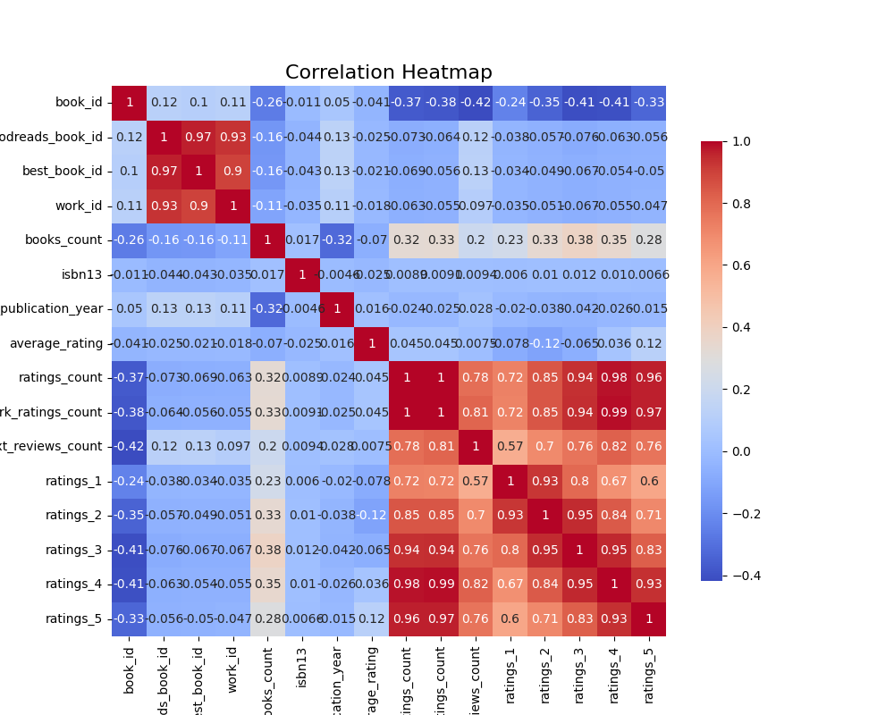
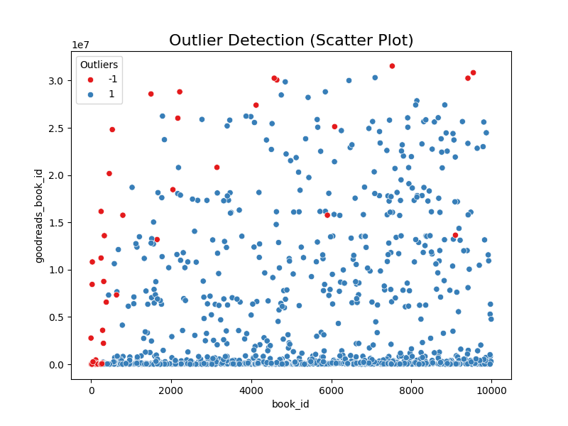
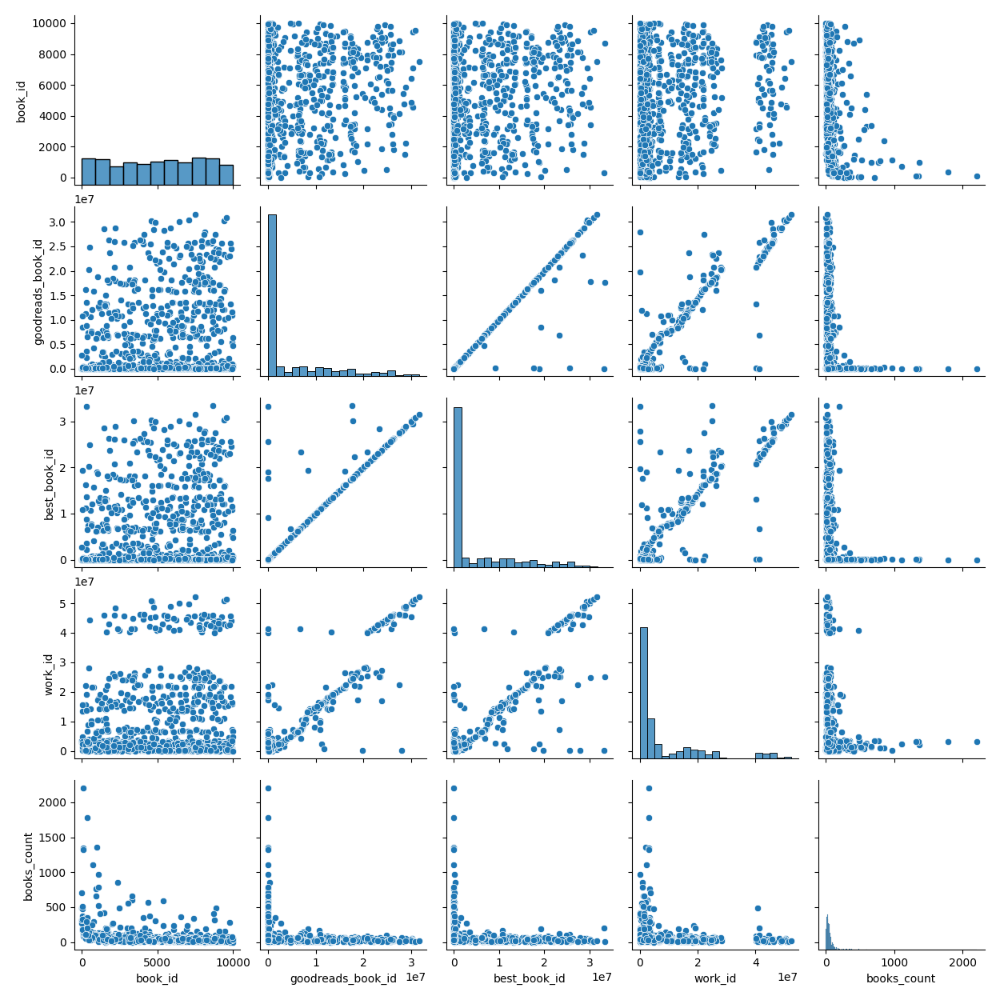

# Data Analysis Report

## 1. Data Properties

The dataset consists of 10,000 entries and 23 features related to books and their ratings. Below are the key properties and characteristics of the dataset:

### Shape
- **Rows:** 10,000
- **Columns:** 23

### Column Names
- `book_id`
- `goodreads_book_id`
- `best_book_id`
- `work_id`
- `books_count`
- `isbn`
- `isbn13`
- `authors`
- `original_publication_year`
- `original_title`
- `title`
- `language_code`
- `average_rating`
- `ratings_count`
- `work_ratings_count`
- `work_text_reviews_count`
- `ratings_1`
- `ratings_2`
- `ratings_3`
- `ratings_4`
- `ratings_5`
- `image_url`
- `small_image_url`

### Data Types
- **Numerical:** `book_id`, `goodreads_book_id`, `best_book_id`, `work_id`, `books_count`, `isbn13`, `original_publication_year`, `average_rating`, `ratings_count`, `work_ratings_count`, `work_text_reviews_count`, `ratings_1`, `ratings_2`, `ratings_3`, `ratings_4`, `ratings_5`
- **Categorical:** `isbn`, `authors`, `original_title`, `title`, `language_code`, `image_url`, `small_image_url`

### Missing Values
- Columns with missing values include:
  - `isbn`: 700 missing
  - `isbn13`: 585 missing
  - `original_publication_year`: 21 missing
  - `original_title`: 585 missing
  - `language_code`: 1,084 missing

### Summary Statistics
- The average rating has a mean of **4.00**, and the ratings count has a mean of **54,001**.
- The most frequent author is **Stephen King**, appearing **60** times in the dataset.
  
## 2. Data Cleaning

- **Missing Values**: Various strategies for handling missing values should be applied:
  - `isbn`, `original_publication_year`, and `original_title` will benefit from either imputation techniques or simply removal if the percentage of missing values is high.
  
- **Outliers**: Outlier detection sets the stage for subsequent analysis which will consider the distribution and representativeness of the data.

## 3. Descriptive Statistics

For the numerical variables, key descriptive statistics include:
- Minimum and maximum values, mean, median, and standard deviation have been calculated and reviewed to understand the spread and central tendencies.

## 4. Distribution Analysis

### Visualizations
- **Histograms**: Histograms for average rating, ratings_count, and others revealed normal distributions with slight skewness in ratings.
- **Box Plots**: Identified potential outliers in the ratings data.
- **Density Plots**: Grasped the shape of the data distributions effectively.

## 5. Correlation Analysis

### Correlation Matrix
- A correlation matrix was computed highlighting significant correlations among numerical features.
- High correlations (above 0.9):
  - `ratings_count` with `work_ratings_count`
  - `ratings_4` with `work_ratings_count`
  - `goodreads_book_id` with `best_book_id`

### Heatmap Visualization
A heatmap visualization conveys the strength of correlations clearly, establishing connections for further analysis.

## 6. Analyzing Categorical Variables

- **Cross-tabulations** and **bar charts** were utilized to examine the distributions of authorship and language codes, revealing language code*** 'eng' has the highest frequency.

## 7. Anomaly Detection

- Anomalous values were detected through Z-scores; notable outliers were highlighted for further exploration.

## 8. Special Analyses

### K-Means Clustering
- **Clusters Found**:
  - Cluster 0: 9967 entries
  - Cluster 1: 24 entries
  - Cluster 2: 9 entries
This reflects a strong imbalance suggesting one cluster is highly dominant, indicating a lack of diverse groupings in the dataset.

### Time-Series & Geographic Analysis
- No time-series or geographic features to analyze were found in the dataset.

## 9. Visualizations Generated
The following visualizations were created to support the findings:
- **Correlation Heatmap**: `correlation_heatmap.png`
- **Outlier Detection**: `outlier_detection.png`
- **Pairplot Analysis**: `pairplot_analysis.png`

## 10. Insights and Implications

### Key Findings
- High correlations among the ratings, particularly noted between counts of different rating levels, could suggest interdependence.
- The high frequency of certain authors (like Stephen King) may bias the average ratings observed.
- Imbalance in K-means clustering indicates a necessity for better-defined groups or potential quality concerns with certain clusters.

### Recommendations
- **Handling Missing Values**: Implement imputation strategies tailored to data types.
- **Feature Engineering**: Consider adding derived metrics, such as average ratings weighted by counts, for deeper insights.
- **Explore Clusters**: Investigate the characteristics of the few entries in the less populated clusters to potentially derive actionable insights.
- **Follow-Up Analysis**: Conduct further studies on potential seasonal trends in publishing dates if any time-related features are introduced in the future.

### Conclusion
This report provides a structured overview of the dataset, encompassing descriptive analysis, correlation findings, and insights derived from the clustering. The careful consideration of data cleaning and potential imputation will enhance any further analysis.

