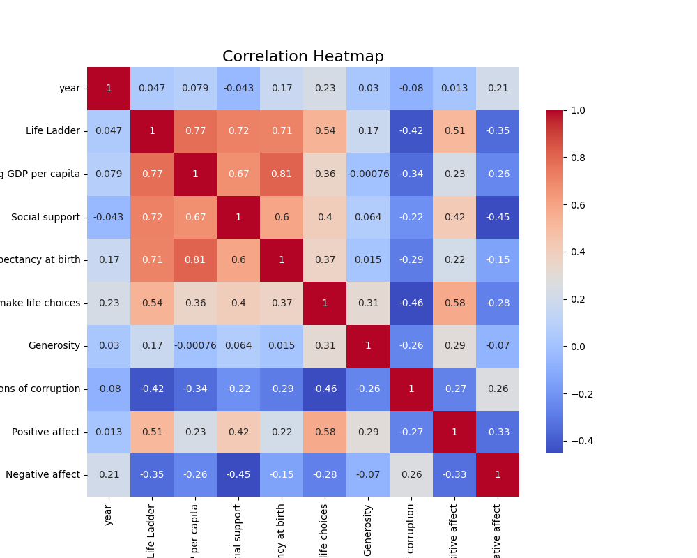
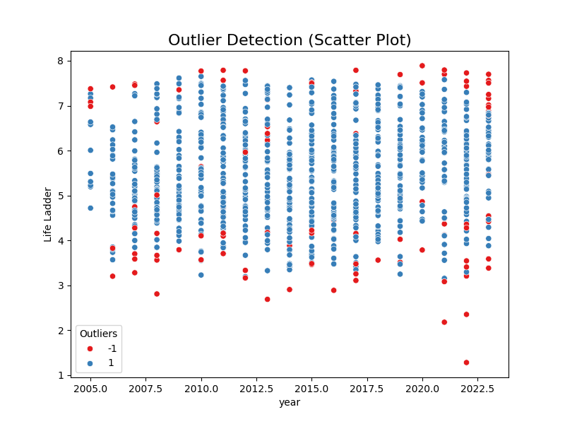
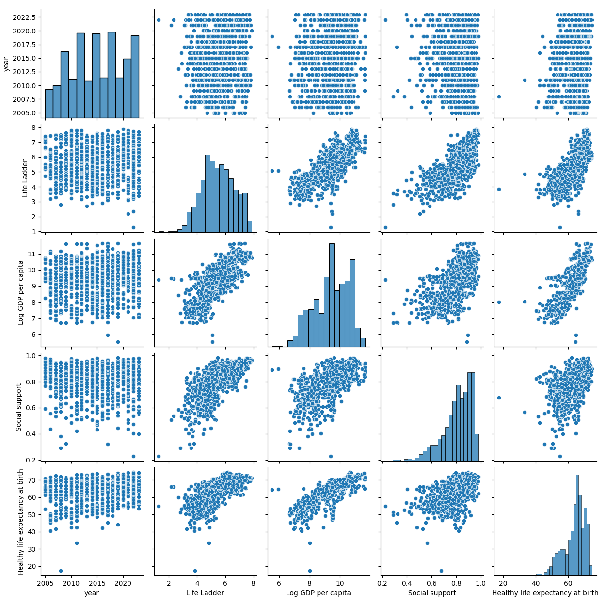

# Data Analysis Report

## 1. Data Properties

The dataset under review comprises various attributes related to countries and their socio-economic indicators over time. Below are key characteristics:

- **Shape**: (2363, 11)
- **Columns**:
  - Country name
  - Year
  - Life Ladder
  - Log GDP per capita
  - Social support
  - Healthy life expectancy at birth
  - Freedom to make life choices
  - Generosity
  - Perceptions of corruption
  - Positive affect
  - Negative affect

### Data Types and Missing Values

- **Data Types**:
  - `Country name`: object
  - `year`: int64
  - `Life Ladder`: float64
  - `Log GDP per capita`: float64
  - `Social support`: float64
  - `Healthy life expectancy at birth`: float64
  - `Freedom to make life choices`: float64
  - `Generosity`: float64
  - `Perceptions of corruption`: float64
  - `Positive affect`: float64
  - `Negative affect`: float64

- **Missing Values**:
  - Log GDP per capita: 28
  - Social support: 13
  - Healthy life expectancy at birth: 63
  - Freedom to make life choices: 36
  - Generosity: 81
  - Perceptions of corruption: 125
  - Positive affect: 24
  - Negative affect: 16

### Summary Statistics

| Metric                               | Count | Mean            | Std Dev        | Min   | 25%   | 50%   | 75%   | Max   |
|--------------------------------------|-------|-----------------|----------------|-------|-------|-------|-------|-------|
| **Year**                             | 2363  | 2014.76         | 5.06           | 2005  | 2011  | 2015  | 2019  | 2023  |
| **Life Ladder**                      | 2363  | 5.48            | 1.13           | 1.28  | 4.65  | 5.45  | 6.32  | 8.02  |
| **Log GDP per capita**              | 2335  | 9.40            | 1.15           | 5.53  | 8.51  | 9.50  | 10.39 | 11.68 |
| **Social support**                   | 2350  | 0.81            | 0.12           | 0.23  | 0.74  | 0.83  | 0.90  | 0.99  |
| **Healthy life expectancy at birth** | 2300  | 63.40           | 6.84           | 6.72  | 59.20 | 65.10 | 68.55 | 74.60 |
| **Freedom to make life choices**     | 2327  | 0.75            | 0.14           | 0.23  | 0.66  | 0.77  | 0.86  | 0.99  |
| **Generosity**                       | 2282  | 0.0001          | 0.16           | -0.34 | -0.11 | -0.02 | 0.09  | 0.70  |
| **Perceptions of corruption**        | 2238  | 0.74            | 0.18           | 0.04  | 0.69  | 0.80  | 0.87  | 0.98  |
| **Positive affect**                  | 2339  | 0.65            | 0.11           | 0.18  | 0.57  | 0.66  | 0.74  | 0.88  |
| **Negative affect**                  | 2347  | 0.27            | 0.09           | 0.08  | 0.21  | 0.26  | 0.33  | 0.71  |

## 2. Insights

### Key Statistical Findings

- **Strong Positive Correlations**: 
  - Log GDP per capita and Healthy life expectancy at birth (0.81)
  - Life Ladder and Log GDP per capita (0.77)
  - Social support and Life Ladder (0.72)
  - Healthy life expectancy at birth and Life Ladder (0.71)

### Group Analysis

- **Clustering Results**:
  - Three clusters identified in the data: 
    - Cluster 0: 908 entries
    - Cluster 1: 602 entries
    - Cluster 2: 853 entries

## 3. Visualizations

### Correlation Matrix

- This heatmap visualizes the strength of relationships between numerical variables in the dataset.

### Outlier Detection

- The outlier detection plot highlights extreme values, which can significantly influence the average and analysis results.

### Pair Plot Analysis

- This pair plot provides insights into the pairwise relationships across multiple numeric variables.

## 4. Implications and Recommendations

- **Further Analysis**: Due to significant correlations between socio-economic metrics, further analysis could explore causal relationships, possibly through regression analysis.
- **Data Cleaning**: Addressing the missing values using appropriate imputation techniques is crucial before any predictive modeling.
- **Cluster Examination**: Understanding the features that define different clusters can provide insights into group behaviors and characteristics.

## Conclusion

This report compiles crucial aspects of the dataset, outlines methods of analysis, and provides key insights into socio-economic indicators across countries. Further analysis could offer valuable insights for policymakers, researchers, and economists interested in understanding the world's well-being metrics.

