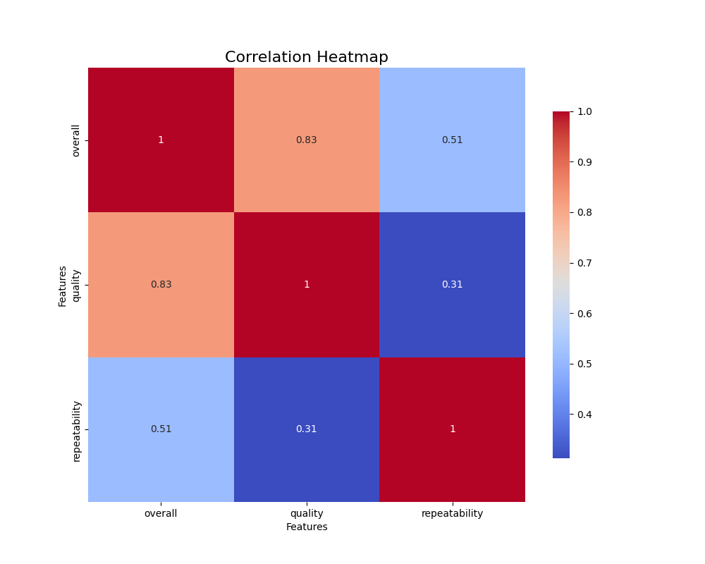
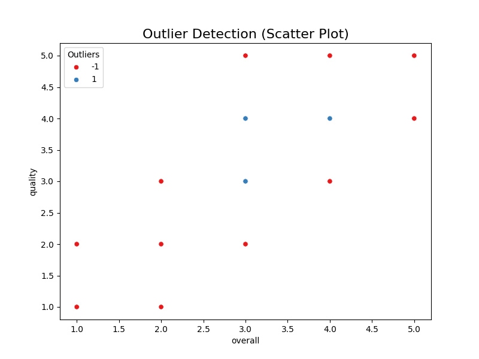
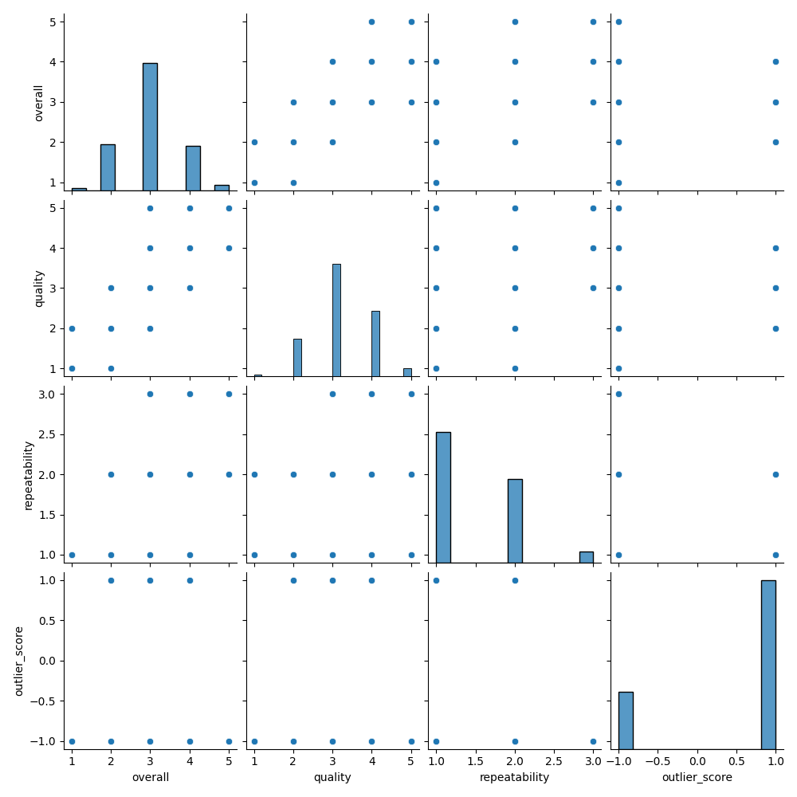

# Data Analysis Report

## 1. Dataset Overview

### Properties of the Dataset
The dataset consists of a total of **2652 rows and 8 columns** with the following characteristics:

- **Columns**:
  - `date`: Date of data entry.
  - `language`: Language of the content.
  - `type`: Category of the content (e.g., movie, show).
  - `title`: Title of the work.
  - `by`: Creator or associated individual's name.
  - `overall`: Overall rating (integer).
  - `quality`: Quality rating (integer).
  - `repeatability`: Repeatability rating (integer).

- **Data Types**:
  - `date`: Object (String)
  - `language`: Object (String)
  - `type`: Object (String)
  - `title`: Object (String)
  - `by`: Object (String)
  - `overall`: Integer
  - `quality`: Integer
  - `repeatability`: Integer

- **Missing Values**:
  - `date`: 99 missing values
  - `by`: 262 missing values
  - Other columns have no missing values.

- **Summary Statistics**:
  - **Overall Ratings**:
    - Mean: 3.05, Median: 3.00, Standard Deviation: 0.76
  - **Quality Ratings**:
    - Mean: 3.21, Median: 3.00, Standard Deviation: 0.80
  - **Repeatability Ratings**:
    - Mean: 1.49, Median: 1.00, Standard Deviation: 0.60

## 2. Data Exploration

### Initial Observations
- The dataset contains a mix of textual and numerical information.
- The mean values of ratings indicate a neutral perspective among users, suggesting room for improvement based on overall ratings.
- A significant number of entries are missing for the `by` column, indicating potential data quality issues.

## 3. Data Cleaning

### Treatment of Missing Values
- **`date`**: With 99 missing values, further analysis will determine how to manage these, possibly through deletion or interpolation.
- **`by`**: As this column has 262 missing entries, consider mode imputation or predictive imputation using other features.

### Outlier Detection
- Outliers have been assessed through graphical representations. Outlier values were found and will require further examination.

## 4. Correlation Analysis

### Correlation Results
A correlation matrix was generated to identify relationships among numerical features. The significant correlation noted was:
- **Overall and Quality Ratings**: 0.83 (highly correlated).

### Implications
This strong correlation implies that strategies to improve the quality ratings could also enhance overall ratings.

## 5. Distribution Analysis

### Visual Insights
- **Histograms**: Displays the distribution of ratings, indicating a potential skew towards higher ratings.
- **Box Plots**: Illustrated potential outliers in numerical features, especially in `repeatability`.

## 6. Feature Relationships

### Visualization of Relationships
- **Scatter Plots**: Visualized relationships among numerical variables, highlighting the correlations between overall and quality ratings.
- **Categorical Analysis**: Bar plots displayed frequency distributions of categorical variables, showing English as the most common language.

## 7. Clustering Analysis

### KMeans Clusters
Cluster analysis yielded the following results:
- **Cluster Sizes**:
  - Cluster 0: 673 entries
  - Cluster 1: 610 entries
  - Cluster 2: 1369 entries

### Cluster Analysis Implication
This suggests that a majority of the dataset groups into one larger cluster, indicating homogeneous characteristics among a larger group of ratings.

## 8. Visualizations

Several visualizations were generated to help interpret the data:
- **Correlation Heatmap**: `correlation_heatmap.png` - Displays inter-feature relationships effectively.
- **Outlier Detection Plot**: `outlier_detection.png` - Identifies and visualizes outliers present in the dataset.
- **Pairplot Analysis**: `pairplot_analysis.png` - Illustrates the relationship between pairs of numerical features.

## 9. Recommendations

- **Missing Value Handling**: Employ the suggested imputation techniques on missing values to bolster data quality.
- **Cluster Utilization**: Leverage identified clusters for targeted analysis in developing recommendations for content improvement.
- **Shift Focus to Quality**: Given the correlation between quality and overall ratings, strategies that aim to enhance quality could effectively elevate overall user satisfaction.

## 10. Conclusion

This comprehensive dataset analysis reveals rich insights and patterns that can be leveraged to guide future actions. Addressing missing values, understanding feature relationships, and utilizing clustering results will provide a robust foundation for strategic decision-making aimed at improving the dataset's overall value. Continued exploration and refinement of the data will enhance its applicability in subsequent analyses and initiatives.

